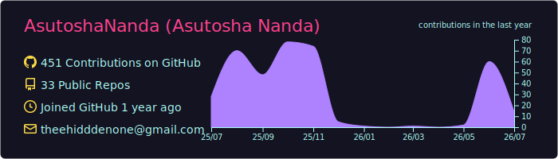
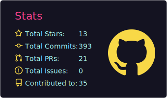
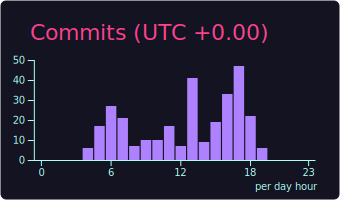
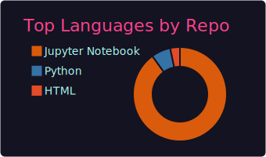
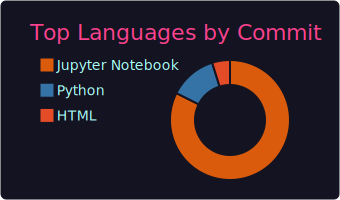

  

<h3 align="center">Generative AI &amp; Data Engineer &nbsp;|&nbsp; Multi-Agent LLM Systems &nbsp;|&nbsp; Big-Data Engineering</h3>

  

[-000000?style=for-the-badge&logo=x&logoColor=white)](https://x.com/its_asutosha)

## About Me

- Generative AI &amp; Data Engineer in Bangalore. Currently a Systems Engineer Intern at Infosys and a final-year CSE student at KIIT.
- Most of my work is on LLM applications — multi-agent systems, RAG, and the retrieval and vector-store plumbing that makes them actually reliable.
- On the data side I build Lakehouse / Medallion pipelines with Python, PySpark and Databricks on Azure.
- I go full-stack when a project calls for it: Spring Boot, React and REST APIs.
- Currently digging deeper into agent design and evaluation. Happy to talk shop on GenAI or data work.

 

## Experience

**Systems Engineer Intern — [Infosys](https://www.infosys.com/)** &nbsp;·&nbsp; Dec 2025 – May 2026 · Mysuru, Karnataka

- Engineered **20+ RESTful API endpoints** across **8 Spring Boot controllers** serving a React frontend, within a **5-developer Agile team** delivering **14 user stories over 2 sprint cycles**.
- Built responsive **React** interfaces with reusable components and optimized state management for a smooth, consistent user experience.
- Achieved **84% code coverage** using **JUnit, Mockito, and WebMvcTest**, hardening the API against regressions.

  

 

  
  

  
  

 

## Tech Arsenal

  

### Generative AI &amp; LLMs

### Programming Languages

### Python Libraries

### Big Data Engineering

### Data Architecture

### Web &amp; Full Stack

### Cloud, Tools &amp; DevOps

-0089D6?style=flat&logo=microsoftazure&logoColor=white)

### Core CS &amp; Methods

## GitHub Activity

